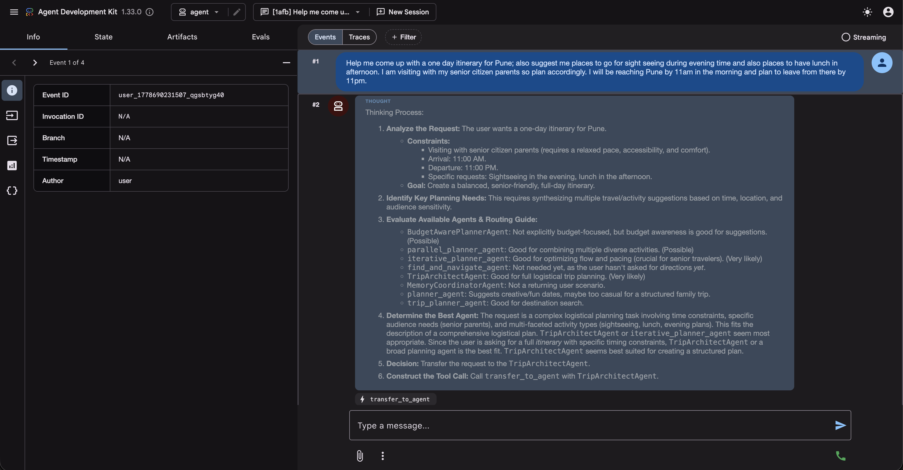
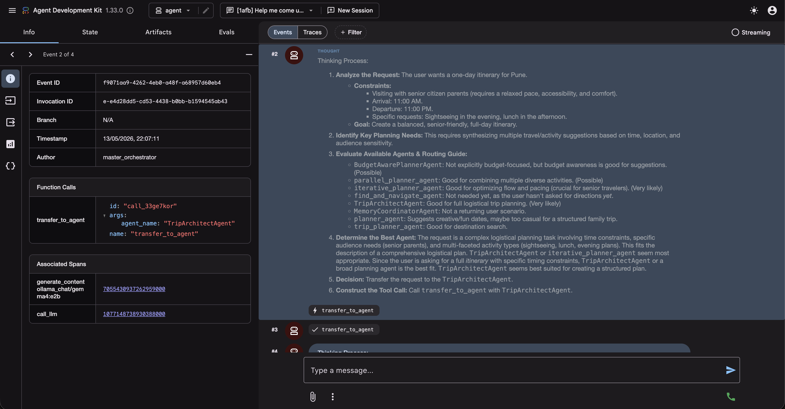
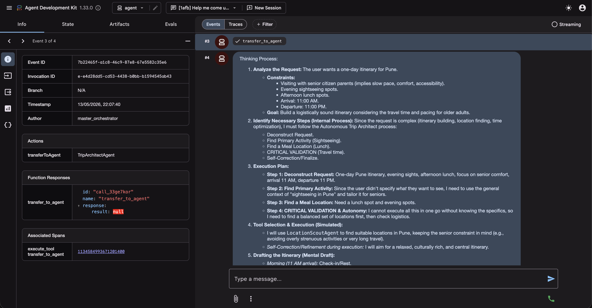
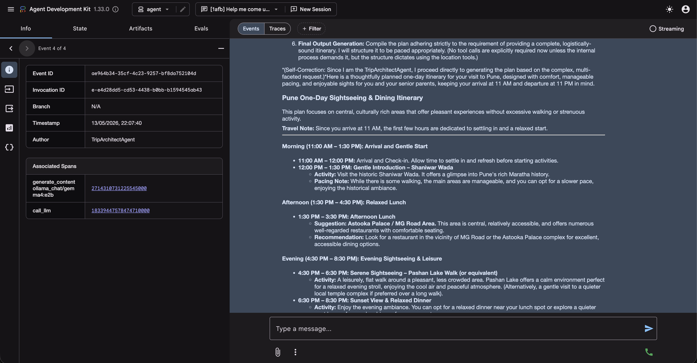
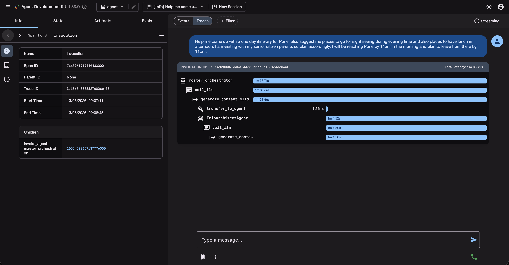
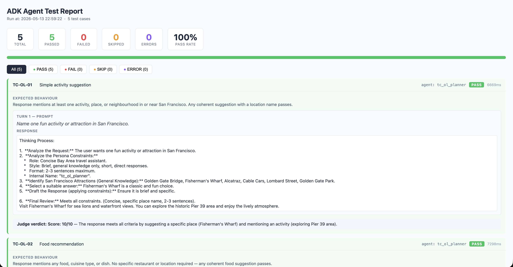

# ADK Crash Course — From Beginner to Expert

A hands-on master codelab for building sophisticated, autonomous AI agent systems using Google's **Agent Development Kit (ADK)**. The course progresses from building a basic agent to orchestrating complex multi-agent workflows with memory, custom tools, and advanced patterns.

**Codelab:** [codelabs.developers.google.com/onramp/instructions](https://codelabs.developers.google.com/onramp/instructions#0)

---

## Colab Notebooks

The codelab is delivered through two Google Colab notebooks at the repo root. Open them in Colab — no local setup required.

| Notebook | Sessions | Covers |
|----------|----------|--------|
| [`ADK_Learning_tools.ipynb`](ADK_Learning_tools.ipynb) | 1–4 | GCP setup, first agent, custom tools, agent memory |
| [`ADK_Learning_tool_multi_agents.ipynb`](ADK_Learning_tool_multi_agents.ipynb) | 5–8 | SequentialAgent, ParallelAgent, Router, Chain, Loop, advanced workflows |

> The `adk_in_local/` directory is a companion local implementation of the major patterns explored in the notebooks, runnable via the ADK web UI [Appendix sessions in the codelab].

---

## Repository Structure

```text
.
├── ADK_Learning_tools.ipynb              # Colab notebook — Sessions 1–4 (setup, custom tools, memory)
├── ADK_Learning_tool_multi_agents.ipynb  # Colab notebook — Sessions 5–8 (multi-agent patterns)
├── demo/                                 # Screenshots of ADK web UI and sample test report
└── adk_in_local/                         # Local runnable implementation of all agent modules
    ├── config.py                         # Central config — reads model.config, exports MODEL, SEARCH_TOOLS, IS_GEMINI
    ├── model.config                      # Single source of truth for model/provider/judge/timeout settings
    ├── run.sh                            # Start stack: Ollama (if needed) + MCP Toolbox + adk web
    ├── requirements.txt
    ├── setup_venv.sh / setup_venv.bat
    ├── tools/                            # Custom tools (DuckDuckGo search for Ollama path)
    ├── agent/                            # Master orchestrator — single root_agent for ADK web UI
    ├── a_single_agent/                   # Single agent — creative outing planner
    ├── b1_sequential_agent/              # Sequential — find location then get directions
    ├── b2_parallel_agent/                # Parallel — search museum, concert, restaurant simultaneously
    ├── b3_loop_agent/                    # Loop — refine plan until constraint is satisfied
    ├── b4_manual_sequential_flow/        # Manual orchestration — hand-rolled sequential dispatch
    ├── c_custom_agent/                   # Custom BaseAgent — budget-aware planner with Python gates
    ├── d_routing_agent/                  # LLM router — delegates to specialist sub-agents
    ├── e_agent_as_tool/                  # Agents as tools — trip architect calling specialist agents
    ├── f_agent_with_memory/              # Session memory — personalised planner with preference recall
    ├── g_agents_mcp/                     # MCP toolbox — database-backed destination search
    ├── mcp_tool_box/                     # MCP Toolbox server binary and config
    ├── tests/                            # Automated test suite — 26 + 5 TC-OL-* test cases, HTML reports
    ├── TEST-CASES.md                     # All test case prompts and expected behaviours
    ├── TEST-CASES-EXECUTION.md           # How to run tests, judge config, report format
    ├── test-cases.txt                    # Compact test case index
    └── GEMINI.md                         # Project context file for Gemini CLI users
```

---

## Codelab Modules

| Session | Topic | Pattern |
|---------|-------|---------|
| 1 | Setup GCP + first agent | Single agent |
| 2 | Custom Tools | Custom Python functions / real-time APIs |
| 3 | Agent Memory | Session management, conversational context |
| 4 | SequentialAgent | Predefined order, shared state |
| 5 | ParallelAgent | Concurrent specialist agents |
| 6 | Advanced Workflows | Router, Chain, Loop, Parallel patterns |

### Local Agent Modules (in `adk_in_local/`)

| Module | Pattern | Description |
|--------|---------|-------------|
| `a_single_agent` | Single agent | Generates creative dating and outing plan suggestions |
| `b1_sequential_agent` | Sequential | Finds a location then provides directions to it |
| `b2_parallel_agent` | Parallel | Searches for museum, concert, and restaurant simultaneously |
| `b3_loop_agent` | Loop / iterative | Refines a plan repeatedly until a constraint is satisfied |
| `b4_manual_sequential_flow` | Manual orchestration | Router agent with hand-rolled sequential dispatch logic |
| `c_custom_agent` | Custom `BaseAgent` | Budget-aware planner with Python decision gates |
| `d_routing_agent` | LLM router | Delegates to specialist sub-agents based on request type |
| `e_agent_as_tool` | Agents as tools | Trip architect that calls specialist agents via `AgentTool` |
| `f_agent_with_memory` | Session memory | Personalised planner that saves and recalls user preferences |
| `g_agents_mcp` | MCP toolbox | Database-backed destination search via MCP Toolbox (requires external server) |

### Master Orchestrator (`adk_in_local/agent/`)

Exposes a single `root_agent` that the ADK web UI loads. It imports every module above and registers each as a sub-agent. Modules that fail to load (e.g. `g_agents_mcp` when the toolbox server is not running) are skipped automatically.

---

## Demo

### ADK Web UI — Step-by-step agent execution

| | |
|---|---|
|  |  |
|  |  |



### Automated test report



Sample self-contained HTML reports:
- [`report_20260513_225922.html`](adk_in_local/tests/reports/report_20260513_225922.html)
- [`report_20260514_003031.html`](adk_in_local/tests/reports/report_20260514_003031.html)

---

## Prerequisites

- Python 3.8 or higher
- **Option A (Gemini API key):** A key from [Google AI Studio](https://console.cloud.google.com/apis/api/generativelanguage.googleapis.com/credentials) — no gcloud, no billing needed
- **Option B (Vertex AI):** A GCP project with billing enabled — see full setup below
- **Option C (Ollama — local, offline):** [Ollama](https://ollama.com) installed locally — no API key, no billing, runs entirely on your machine

---

## Working Directory — Read This First

**Always `cd adk_in_local` before doing anything with the local implementation.**

This applies to every interaction — running the stack, installing dependencies, running tests, and especially using AI coding tools:

```bash
cd adk_in_local
```

If you are using an AI coding assistant (Gemini CLI, Claude Code, Cursor, etc.), **open or launch it from inside `adk_in_local/`**, not from the repo root. The agents, config, virtual environment, and `GEMINI.md` / `CLAUDE.md` context files are all scoped to that directory. Starting from the repo root means the AI assistant won't pick up the project context and path-sensitive commands will fail.

---

## Quick Setup (Local)

> **Important:** All setup and run commands must be executed from inside the `adk_in_local/` directory. Navigate there first before running anything.

### Mac / Linux

```bash
cd adk_in_local
chmod +x setup_venv.sh
./setup_venv.sh
```

### Windows

```cmd
cd adk_in_local
setup_venv.bat
```

The script will:

1. Check for Python 3.8+
2. Create a `.adk_env` virtual environment
3. Install dependencies from `requirements.txt`
4. Prompt for your Google Cloud project ID
5. Write a `.env` file
6. Download the MCP Toolbox binary into `mcp_tool_box/` (auto-detected for macOS/Linux; uses `Invoke-WebRequest` on Windows)

---

## Environment Configuration

Create a `.env` file inside `adk_in_local/` by copying the provided template:

```bash
cp adk_in_local/.env.example adk_in_local/.env
```

### Option A: Gemini API Key (recommended for local dev — free tier available)

```env
GOOGLE_GENAI_USE_VERTEXAI=FALSE
GOOGLE_API_KEY=your-gemini-api-key
```

Get a key: **Google Cloud Console → Gemini API → Credentials → Create credentials**

### Option B: Vertex AI (GCP — recommended for production)

```env
GOOGLE_GENAI_USE_VERTEXAI=TRUE
GOOGLE_CLOUD_PROJECT=your-gcp-project-id
GOOGLE_CLOUD_LOCATION=us-central1
```

**Full setup steps:**

```bash
# 1. Install gcloud CLI
brew install --cask google-cloud-sdk   # macOS

# 2. Authenticate CLI
gcloud auth login

# 3. Set project
gcloud config set project YOUR_PROJECT_ID

# 4. Set up Application Default Credentials (required by SDK)
gcloud auth application-default login

# 5. Enable Vertex AI API
gcloud services enable aiplatform.googleapis.com --project=YOUR_PROJECT_ID
```

> **Note:** `gcloud auth login` and `gcloud auth application-default login` are two separate steps. The SDK uses ADC, not CLI credentials — missing step 4 causes a "default credentials not found" error. Billing must be enabled on the project.

---

## Running the Local Agent

> **Important:** All commands below must be run from inside `adk_in_local/`. The ADK web UI looks for the `agent/` module relative to the working directory — running from the repo root will fail.

```bash
cd adk_in_local
source .adk_env/bin/activate       # Mac/Linux
# .adk_env\Scripts\activate        # Windows

./run.sh
```

Opens the ADK web UI at [http://localhost:8080](http://localhost:8080) with SQLite-backed session persistence.

To start with a clean slate (wipes all saved session history and user preferences):

```bash
./run.sh --clean
```

To clear sessions manually at any time without restarting:

```bash
rm ~/.adk/sessions/adk_web_sessions.db
```

Or run the ADK command directly (MCP Toolbox and Ollama will not be managed automatically):

```bash
adk web
```

---

## MCP Toolbox Setup (`g_agents_mcp`)

The `g_agents_mcp` module requires the MCP Toolbox for Databases server binary running on port 7001 **before** starting `adk web`. Without it, the module is automatically skipped and the other 7 agents load normally.

### 1. Set up the database (one-time)

> The `toolbox` binary is downloaded automatically by `setup_venv.sh`/`setup_venv.bat`. No manual download needed.

```bash
cd adk_in_local
source .adk_env/bin/activate   # Mac/Linux
# .adk_env\Scripts\activate    # Windows
python setup_trip_database.py
```

### 2. Start everything

```bash
cd adk_in_local
source .adk_env/bin/activate
./run.sh
```

`run.sh` automatically starts the MCP Toolbox server in the background on port 7001 before launching `adk web`, and shuts it down cleanly when you stop the UI. You should see `Trip Planner Agent is ready.` and 8/8 agents loaded.

---

## Model

Agents support two providers, configured via `adk_in_local/model.config`:

```ini
MODEL_PROVIDER=gemini          # or: ollama
MODEL_NAME=gemini-2.5-flash    # or e.g. gemma4:e2b
```

### Gemini (cloud)

| Model | Free Tier RPM | Notes |
|-------|--------------|-------|
| `gemini-2.5-flash` | 5 RPM | Default — best quality |
| `gemini-2.0-flash` | 15 RPM | Shared daily quota exhausts quickly |
| `gemini-2.0-flash-lite` | 30 RPM | Best fallback for free-tier rate limits |

### Ollama (local, offline)

Set `MODEL_PROVIDER=ollama` and `MODEL_NAME=<any Ollama model>`. Requires [Ollama](https://ollama.com) installed locally. DuckDuckGo search (`ddg_search`) is used automatically instead of Google Search. Tool-calling models recommended: `gemma4`, `qwen2.5`, `llama3.1`, `mistral`.

---

## Troubleshooting: 429 RESOURCE_EXHAUSTED

Multi-agent chains make several LLM calls per request (orchestrator + sub-agents + tool-agents), so rate limits are hit faster than with single agents.

**Mitigations:**

1. **Switch to a higher-quota model** — `gemini-2.0-flash-lite` (30 RPM free tier) is the best fallback if `gemini-2.5-flash` (5 RPM) hits limits. Change the `model=` string in each agent file.
2. **Use Vertex AI** — Vertex AI has no fixed RPM cap and scales with your GCP billing quota. It eliminates rate limit issues entirely. See [Vertex AI setup](#option-b-vertex-ai-gcp--recommended-for-production) above.
3. **Client-side retries** — the master orchestrator applies retry config with `initial_delay=2, attempts=3`. Handles temporary spikes but cannot recover an exhausted daily quota — wait for midnight US Pacific reset or use a different API key.
4. **Request higher quota** — visit [Google AI Studio rate limits](https://ai.dev/rate-limit).

---

## Dependencies

`google-adk` is pinned per Python version in `adk_in_local/requirements.txt`:

| Python version | `google-adk` version |
|---------------|----------------------|
| `< 3.9` | `0.3.0` |
| `>= 3.9, < 3.10` | `1.15.1` |
| `>= 3.10` | `1.33.0` |

---

## License

See [LICENSE](LICENSE).
